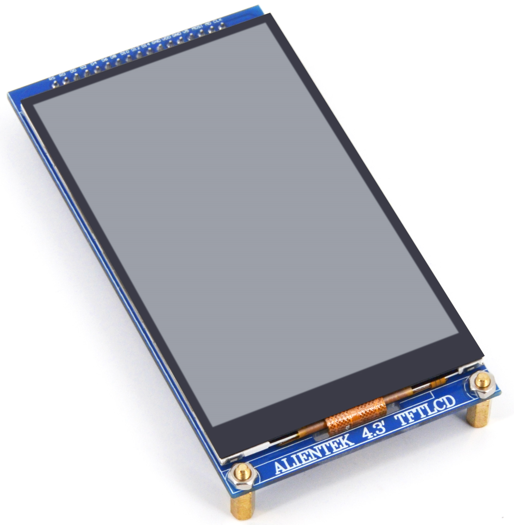
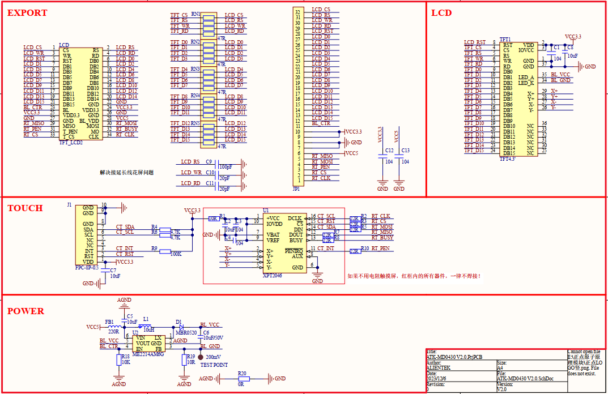

## 1 Introduction

### 1.1 Appearence

The ATK-MD0430 module looks like this:

### 1.2 Features

The ATK-MD0430 module is a high-performance 4.3-inch TFT LCD capacitive touchscreen module launched by ALIENTEK. The module has an LCD resolution of 480*800 pixels, supports 16-bit true color display, and uses NT35510 as the LCD driver chip. This chip comes with its own RAM, eliminating the need for additional drivers or memory. As a result, most external controllers can easily drive the module.  At the same time, the ATK-MD0430 module also supports touch, using a capacitive touch screen that supports 5-point simultaneous touch, providing excellent control effects.

### 1.3 Parameter

Here are the product basic parameters:

| Parameter               | Describe                                                     |
| ----------------------- | ------------------------------------------------------------ |
| Communication Interface | LCD: Intel 8080-16 bit parallel port Touch: IIC          |
| Color Format            | RGB565                                                       |
| Color Depth             | 16-bit                                                       |
| Driver Chip             | NT35510                                                      |
| LCD Resolution          | 480*800                                                      |
| Screen Size             | 4.3 inch                                                     |
| Touch screen type       | Capacitive touch                                             |
| Touch Sampling Chip     | GT911                                                        |
| Touch Point Count       | Up to 5 simultaneous touch points                            |
| Operating Temperature   | -20°C ~ 70°C                                                 |
| Storage Temperature     | -30°C ~ 80°C                                                 |
| Mudule Size             | 62.25mm*117.5mm                                              |

The electrical parameters are shown in the following table:

| Parameter         | Describe                                                     |
| ----------------- | ------------------------------------------------------------ |
| Supply voltage    | 5V                                                           |
| IO port level     | 3.3V                                                         |
| Power dissipation | LCD backlight is off: 30mA Maximum brightness of LCD backlight: 180mA |

### 1.4 Interface

The ATK-MD0430 module is connected to the external circuit through a 2*17 row pin (2.54mm spacing), each pin is connected to the external circuit. A detailed description is given in the following table:

| Number | Name  | Describe                                                    |
| ------ | ----- | ----------------------------------------------------------- |
| 1      | CS    | Power supply (5V) CTP external reset signal, Low is active  |
| 2      | RS    | Command and data control signal (0: command; 1: Data)       |
| 3      | WR    | Write enable signal (valid at low level)                    |
| 4      | RD    |Read enable signal (low level valid)                         |
| 5      | RST   | Reset signal (low level valid)                              |
| 6~21   | D0~D15| BDB(bidirectional data bus)                                 |
| 22,26,27| GND  | Power ground                                                |
| 23     | BL    | LCD backlight control signal (0: turn off LCD backlight; 1: Turn on LCD backlight) |
| 24,25  | VDD   | Main power supply (3.3V)                                    |
| 28     | V5    | LCD backlight power supply (5V)                             |
| 29     | MI    | Ununited                                                    |
| 30     | MO    | Touch the IIC communication data signal                     |
| 31     | PEN   | Touch interrupt signal (0: touch; 1: no touch)              |
| 32     | NC    | Ununited                                                    |
| 33     | TCS   | Touch reset signal (low level valid)                        |
| 34     | CLK   | Touch the IIC communication clock signal                    |

## 2 Schematic

The schematic diagram of the ATK-MD0430 module is shown as follows.

